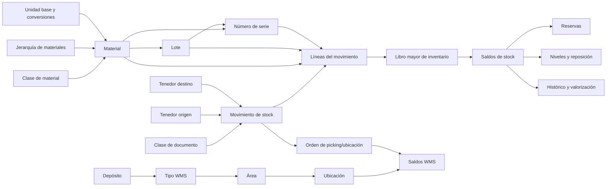

# Especificación funcional del módulo de inventario y movimientos de stock

## 1. Objetivo

Este documento describe el funcionamiento del módulo de materiales e inventario relevado en **LSK Core** y propone una versión funcionalmente equivalente, más clara y desacoplada de la tecnología original.

Está pensado para ser entregado a otra IA o equipo de desarrollo con el objetivo de implementar estas capacidades en otro proyecto.

El alcance comprende:

- Materiales, unidades, clases y jerarquías.
- Depósitos y tenedores de stock.
- Clases de documento configurables.
- Entradas, salidas, transferencias y ajustes.
- Lotes, fechas de producción y vencimiento.
- Números de serie y garantías.
- Stock físico, reservado, bloqueado, en calidad y disponible.
- Niveles mínimos, máximos y reposición.
- Costos e historial de costos.
- Historial de stock y trazabilidad.
- Picking y administración interna WMS.
- Consultas y reportes principales.

No incluye la planificación o ejecución completa de manufactura. Producción, compras, ventas y otros módulos pueden generar o referenciar movimientos, pero se consideran integraciones externas.

---

## 2. Concepto central

El inventario no pertenece exclusivamente a un depósito. Pertenece a un **tenedor de stock**.

Un tenedor se identifica con:

```text
tipo de objeto + identificador del objeto + centro/contacto opcional
```

Ejemplos:

- `DEPOSITO + 12`: depósito central.
- `PROVEEDOR + 44`: mercadería todavía atribuida a un proveedor.
- `CLIENTE + 108`: material entregado o en consignación.
- `EMPLEADO + 25`: herramientas asignadas a un empleado.
- `OBRA + 7`: materiales ubicados en una obra.
- `PACIENTE + 310`: insumos o equipos asignados a un paciente.

Esta abstracción permite utilizar el mismo motor para movimientos entre depósitos y para entregas, devoluciones, consignaciones o asignaciones a terceros.

En el sistema relevado, los campos equivalentes son:

- `SrcObjTyp`, `SrcObjCod`, `SrcCntCod`: origen.
- `DstObjTyp`, `DstObjCod`, `DstCntCod`: destino.
- `StkObjTyp`, `StkObjCod`, `StkCntCod`: propietario o ubicación de un saldo.

Para una implementación nueva se recomienda encapsularlos en el tipo `StockHolderRef`.

```json
{
  "type": "WAREHOUSE",
  "id": "12",
  "subLocationId": null
}
```

`subLocationId` representa un centro, sucursal, contacto o subdivisión lógica cuando el tenedor lo requiere. Las ubicaciones físicas WMS se modelan por separado.

---

## 3. Mapa del dominio



---

## 4. Maestros

### 4.1 Material

El material es el artículo físico o inventariable.

Campos mínimos recomendados:

| Campo | Descripción |
|---|---|
| `id` | Identificador interno inmutable. |
| `externalCode` | Código comercial o de integración, único dentro de la empresa. |
| `name` | Descripción del material. |
| `status` | `ACTIVE` o `INACTIVE`. |
| `baseUnitId` | Unidad en la que se mantienen los saldos. |
| `materialClassId` | Clasificación funcional opcional. |
| `hierarchyNodeId` | Nodo de navegación opcional. |
| `usesBatch` | Indica control obligatorio por lote. |
| `usesSerial` | Indica control obligatorio por número de serie. |
| `batchProfileId` | Perfil aplicable a los lotes. Obligatorio si `usesBatch=true`. |
| `serialProfileId` | Perfil aplicable a las series. Obligatorio si `usesSerial=true`. |
| `minimumDeliveryQty` | Cantidad mínima admitida por entrega. |
| `deliveryMultiple` | Múltiplo o tamaño de empaque permitido. |
| `coverageDays` | Días utilizados en cálculos de reposición. |
| `genericMaterialId` | Material genérico relacionado, con un único nivel permitido. |
| `attributes` | Atributos adicionales tipados o esquema extensible. |

Reglas:

1. El código externo, cuando se informa, debe ser único por empresa.
2. La unidad base debe existir y estar activa.
3. Si utiliza lote, debe tener un perfil de lote compatible.
4. Si utiliza serie, debe tener un perfil de serie compatible.
5. No se puede cambiar el control por lote o serie mientras haya stock distinto de cero.
6. Un material inactivo no puede incorporarse a movimientos nuevos.
7. Las cantidades se convierten siempre a la unidad base antes de actualizar o comparar saldos.
8. El material puede usar lote, serie, ambos o ninguno.

### 4.2 Unidades y conversiones

Cada material posee una unidad base. Puede admitir unidades alternativas mediante factores de conversión.

Ejemplo:

```text
1 CAJA = 12 UN
```

Toda línea conserva la cantidad y unidad ingresadas para auditoría, pero genera una `baseQuantity` normalizada.

```text
baseQuantity = enteredQuantity × conversionFactor
```

Las conversiones deben ser determinísticas y conservar la precisión configurada. Se recomienda decimal, nunca punto flotante binario.

### 4.3 Clase de material

La clase agrupa materiales con características similares. Es una clasificación plana e independiente de la jerarquía.

Ejemplos: medicamentos, repuestos, herramientas, descartables.

Puede aportar un esquema de atributos adicionales. No debe eliminarse mientras tenga materiales asociados.

### 4.4 Jerarquía de materiales

La jerarquía organiza los materiales en un árbol de profundidad variable.

Ejemplo:

```text
Insumos
└── Médicos
    ├── Descartables
    └── Medicamentos
```

Cada nodo posee `parentId`. Se recomienda almacenar además una ruta materializada para acelerar búsquedas de ancestros y descendientes.

Reglas:

- Un nodo no puede ser su propio padre ni descendiente de sí mismo.
- No puede eliminarse un nodo ni su subárbol si existen materiales asociados.
- Al mover un nodo deben actualizarse las rutas de todos sus descendientes.

### 4.5 Depósito

Un depósito es un tenedor de tipo `WAREHOUSE`.

Campos principales:

- Código externo único.
- Nombre.
- Estado.
- Comentario.
- Dirección y datos de contacto.
- Clase o perfil del depósito.
- Configuración WMS opcional.

No debe eliminarse si participó en movimientos. Puede inactivarse para impedir operaciones nuevas sin perder trazabilidad.

---

## 5. Clase de documento

La clase de documento define el comportamiento de una familia de movimientos. No debe programarse una pantalla distinta para cada variante; la pantalla y el motor se configuran mediante esta clase.

Ejemplos:

- Recepción de compra.
- Entrada por devolución.
- Entrega a cliente.
- Transferencia entre depósitos.
- Ajuste de inventario.
- Anulación de una salida.

### 5.1 Configuración recomendada

```json
{
  "code": "WAREHOUSE_TRANSFER",
  "movementKind": "TRANSFER",
  "allowedSourceTypes": ["WAREHOUSE"],
  "allowedDestinationTypes": ["WAREHOUSE"],
  "sourceRequired": true,
  "destinationRequired": true,
  "decreaseSource": true,
  "increaseDestination": true,
  "checkSourceAvailability": true,
  "allowNegativeStock": false,
  "createMissingBatches": false,
  "createMissingSerials": false,
  "minimumRemainingShelfLifeDays": 0,
  "numberSequenceId": "TRANSFER",
  "costPolicy": "KEEP_CURRENT",
  "referenceRequired": false,
  "reversalDocumentClassId": "WAREHOUSE_TRANSFER_REVERSAL",
  "pickingRelevant": true,
  "confirmationRelevant": false
}
```

### 5.2 Equivalencia con la configuración relevada

| Concepto | Configuración encontrada |
|---|---|
| Tipo de movimiento | `STK_SIN`, `STK_SOU`, `STK_SIV` |
| Tipo de origen | `srcobjtyp` |
| Tipo de destino | `dstobjtyp` |
| Control de existencia | `matstkctr` |
| Alta de stock en destino | `matstkmgmdst` |
| Creación automática de lote | `matbchcre` |
| Creación automática de serie | `matsercre` |
| Margen mínimo al vencimiento | `matbchduedtectr` |
| Determinación de lote | `matbchdet` |
| Lote o serie manual | `stkmatbchman`, `stkmatserman` |
| Picking | `matpckrel` |
| Confirmación | `stkmovrelcnf` |
| Documento reversor | `docrev`, `refdoccls` |
| Política de costo | `stkmatcstupd` (`PUC` o `PPP`) |

La implementación nueva debe usar campos tipados y no etiquetas XML libres.

---

## 6. Movimiento de stock

### 6.1 Cabecera

```typescript
type StockMovement = {
  id: string;
  companyId: string;
  documentClassId: string;
  documentNumber?: string;
  movementDate: string;
  source?: StockHolderRef;
  destination?: StockHolderRef;
  status: "DRAFT" | "BLOCKED" | "POSTED" | "REVERSED" | "CANCELLED";
  reasonId?: string;
  reference?: DocumentReference;
  comments?: string;
  confirmation?: MovementConfirmation;
  createdAt: string;
  createdBy: string;
  postedAt?: string;
  postedBy?: string;
  version: number;
};
```

### 6.2 Línea

```typescript
type StockMovementLine = {
  id: string;
  movementId: string;
  materialId: string;
  enteredQuantity: Decimal;
  enteredUnitId: string;
  baseQuantity: Decimal;
  batchId?: string;
  batchCode?: string;
  batchExpirationDate?: string;
  serialId?: string;
  serialCode?: string;
  reference?: DocumentLineReference;
  rejectionReasonId?: string;
  capturedUnitCost?: Decimal;
  capturedCurrencyId?: string;
};
```

### 6.3 Estados

- `DRAFT`: editable, no afecta el stock definitivo.
- `BLOCKED`: no puede contabilizarse hasta quitar el bloqueo.
- `POSTED`: contabilizado; es inmutable y afecta saldos.
- `REVERSED`: fue compensado completamente por otro movimiento.
- `CANCELLED`: borrador cancelado sin impacto de stock.

Los movimientos contabilizados no deben modificarse ni borrarse. Una corrección se realiza mediante un contramovimiento enlazado al original.

---

## 7. Cómo se especifica desde dónde y hacia dónde se mueve

La clase documental define **qué tipos de extremo están permitidos** y el documento elige **qué instancia concreta participa**.

Ejemplo de transferencia:

```json
{
  "documentClassId": "WAREHOUSE_TRANSFER",
  "movementDate": "2026-09-14",
  "source": {
    "type": "WAREHOUSE",
    "id": "DEP-CENTRAL"
  },
  "destination": {
    "type": "WAREHOUSE",
    "id": "DEP-NORTE"
  },
  "lines": [
    {
      "materialId": "MAT-100",
      "enteredQuantity": "5",
      "enteredUnitId": "UN",
      "batchCode": "L-2026-09",
      "batchExpirationDate": "2027-09-30"
    }
  ]
}
```

Validaciones:

1. El tipo de cada extremo debe estar habilitado en la clase documental.
2. El objeto debe existir, estar activo y pertenecer a la misma empresa.
3. Cuando la clase exige origen o destino, no pueden omitirse.
4. Una transferencia no puede usar exactamente el mismo origen y destino.
5. Si el tenedor usa subdivisiones, el centro seleccionado debe pertenecer al objeto.
6. Si el extremo es un depósito, puede indicarse además una ubicación WMS en la orden operativa.

### 7.1 Efecto según el movimiento

| Tipo | Origen | Destino | Efecto |
|---|---|---|---|
| Entrada | Externo o informativo | Obligatorio | Suma en destino. |
| Salida | Obligatorio | Externo o informativo | Resta en origen. |
| Transferencia | Obligatorio | Obligatorio | Resta en origen y suma en destino. |
| Ajuste positivo | No aplica | Ubicación ajustada | Suma la diferencia. |
| Ajuste negativo | Ubicación ajustada | No aplica | Resta la diferencia. |

En el sistema original el ajuste reutiliza internamente el extremo destino como ubicación ajustada y acepta cantidades con signo. Para una implementación nueva conviene exponer `holder` y `adjustmentQuantity`, evitando invertir semánticamente origen y destino.

---

## 8. Contabilización

La contabilización es la única operación que modifica el stock definitivo. Debe ejecutarse dentro de una única transacción.

```text
1. Bloquear el documento o verificar su versión.
2. Comprobar que esté en borrador, activo y no bloqueado.
3. Validar clase documental, origen, destino y referencias.
4. Exigir al menos una línea válida.
5. Normalizar unidades.
6. Resolver lotes y series.
7. Validar vencimientos.
8. Calcular stock disponible del origen incluyendo reservas.
9. Rechazar faltantes o conflictos de concurrencia.
10. Asignar el número definitivo del documento.
11. Capturar el costo de cada línea.
12. Escribir asientos inmutables en el libro mayor.
13. Actualizar las proyecciones de saldo de origen y destino.
14. Actualizar ubicación y fechas de las series.
15. Actualizar costo si la clase usa última compra o promedio ponderado.
16. Actualizar histórico y auditoría.
17. Marcar el documento como contabilizado.
18. Confirmar la transacción.
```

Ante cualquier error debe revertirse toda la operación.

La contabilización debe ser idempotente: repetir la misma solicitud con la misma clave no puede duplicar el movimiento.

---

## 9. Tipos de movimiento

### 9.1 Entrada

Se utiliza para recepciones, devoluciones, producción terminada o incorporación inicial.

- Incrementa el destino cuando este administra stock.
- Puede crear automáticamente lotes y series si la clase lo habilita.
- Puede actualizar el costo mediante última compra o promedio ponderado.
- Si proviene de una orden, cada línea mantiene la referencia documental.

### 9.2 Salida

Se utiliza para ventas, consumo, asignaciones o bajas.

- Descuenta el origen.
- Valida stock disponible antes de contabilizar.
- Si hay reservas activas, descuenta del disponible los documentos previos pendientes.
- Puede requerir picking, confirmación de entrega y motivo.

### 9.3 Transferencia

- Combina una salida y una entrada en la misma transacción.
- Conserva material, lote y serie entre ambos extremos.
- El total global del material no cambia.
- Puede generar una orden WMS de retiro y otra de ubicación.

### 9.4 Ajuste

Representa una diferencia encontrada por conteo físico.

- Cantidad positiva: aumenta el saldo.
- Cantidad negativa: disminuye el saldo.
- La disminución requiere existencia suficiente.
- Debe registrar motivo, usuario, fecha y referencia al conteo.
- No debe reemplazar el saldo directamente; debe generar un asiento auditable por la diferencia.

---

## 10. Lotes y vencimientos

Un lote pertenece a un único material.

Campos:

- Identificador interno.
- Código externo único por material.
- Fecha de producción opcional.
- Fecha de vencimiento.
- Proveedor opcional.
- Perfil y atributos.
- Estado.

Reglas:

1. Un material controlado por lote exige lote en cada línea contabilizable.
2. Si se requiere vencimiento, debe informarse junto al lote.
3. La fecha de vencimiento no puede ser anterior a la fecha de producción.
4. Una clase puede exigir una vida útil remanente mínima.
5. Un lote existente aporta su vencimiento canónico; la línea no debe poder contradecirlo.
6. Un lote con movimientos no debe eliminarse.
7. El saldo se separa por material y lote.
8. La determinación automática debería aplicar FEFO: primero vence, primero sale.

---

## 11. Números de serie

Una serie identifica una unidad física individual.

Campos:

- Código de serie único por material.
- Material.
- Lote opcional.
- Proveedor opcional.
- Inicio y fin de garantía del proveedor.
- Inicio y fin de garantía del cliente o tenedor.
- Estado y atributos.

Reglas:

1. Cada línea con serie representa exactamente una unidad.
2. Para mover cinco unidades seriadas deben existir cinco líneas o cinco asignaciones de serie.
3. La serie debe pertenecer al material indicado.
4. Si también se usa lote, la serie debe pertenecer al lote de la línea.
5. Una serie solo puede tener saldo positivo en una ubicación a la vez.
6. Al trasladarla se cierra su posición anterior y se abre la nueva.
7. No puede eliminarse si tiene stock o movimientos pendientes.
8. Las fechas iniciales de garantía no pueden superar sus fechas finales.

---

## 12. Saldos, reservas y disponibilidad

### 12.1 Clave del saldo

```text
empresa
+ tenedor
+ subdivisión opcional
+ material
+ lote opcional
+ serie opcional
+ estado de inventario
```

Se recomienda una restricción única sobre esta clave normalizada.

### 12.2 Cantidades

```text
stock físico = suma de asientos contabilizados
stock reservado = suma de reservas activas
stock bloqueado = cantidad no utilizable por bloqueo
stock en calidad = cantidad pendiente de liberación
stock disponible = físico - reservado - bloqueado - calidad
```

El sistema relevado reserva indirectamente mediante documentos de salida todavía no contabilizados para tenedores configurados. La implementación nueva debe usar una entidad explícita `StockReservation`.

```typescript
type StockReservation = {
  id: string;
  holder: StockHolderRef;
  materialId: string;
  batchId?: string;
  serialId?: string;
  baseQuantity: Decimal;
  sourceDocument: DocumentReference;
  status: "ACTIVE" | "CONSUMED" | "RELEASED" | "EXPIRED";
  expiresAt?: string;
};
```

Las reservas deben consumirse o liberarse atómicamente al contabilizar, cancelar o vencer el documento asociado.

---

## 13. Niveles y reposición

Por tenedor y material se pueden configurar:

- Stock mínimo.
- Stock máximo.
- Mínimo calculado como porcentaje del máximo.
- Stock de reserva.
- Reserva calculada como porcentaje del máximo.
- Punto de reposición.

Criterio recomendado:

1. Si existe máximo y el disponible está debajo del punto de reposición, sugerir hasta el máximo.
2. Si solo existe mínimo, sugerir al menos la diferencia hasta el mínimo.
3. Si existe consumo histórico durante `coverageDays`, utilizar el mayor entre consumo esperado y mínimo.
4. Nunca sugerir una cantidad negativa.

---

## 14. Costos y valorización

Cada material mantiene:

- Costo vigente.
- Moneda.
- Cantidad base del costo, por ejemplo `100 UN`.
- Unidad del costo.
- Historial con fecha y proveedor opcional.

La línea contabilizada captura una copia del costo aplicado para preservar el valor histórico.

Políticas:

- `KEEP_CURRENT`: no modifica el costo maestro.
- `LAST_PURCHASE_PRICE`: reemplaza el costo por el precio normalizado de la compra recibida.
- `WEIGHTED_AVERAGE`: calcula promedio ponderado entre existencia previa y entrada.

```text
nuevo costo medio =
  (cantidad anterior × costo anterior + cantidad entrada × costo entrada)
  / (cantidad anterior + cantidad entrada)
```

Las monedas deben convertirse con el tipo de cambio correspondiente a la política y fecha definidas.

---

## 15. Histórico y trazabilidad

Se recomienda separar:

1. **Libro mayor inmutable:** un asiento por efecto de cada línea y extremo.
2. **Saldo actual:** proyección optimizada para consultas.
3. **Foto histórica:** cierre periódico por tenedor y material, con costo.

Ejemplo de asientos de una transferencia:

```json
[
  {
    "holder": {"type": "WAREHOUSE", "id": "CENTRAL"},
    "materialId": "MAT-100",
    "batchId": "LOT-9",
    "quantity": "-5",
    "movementId": "MOV-850"
  },
  {
    "holder": {"type": "WAREHOUSE", "id": "NORTH"},
    "materialId": "MAT-100",
    "batchId": "LOT-9",
    "quantity": "5",
    "movementId": "MOV-850"
  }
]
```

La suma global de ambos asientos es cero. El libro mayor permite reconstruir saldos, seguir una serie, auditar un lote y explicar cualquier variación.

---

## 16. WMS, picking y ubicación interna

La estructura interna recomendada es:

```text
Depósito
└── Tipo o sector operativo
    └── Área
        └── Ubicación física
```

Ejemplo:

```text
Depósito Central
└── Almacenamiento general
    ├── Recepción
    ├── Picking
    └── Rack A
        ├── A-01-01
        └── A-01-02
```

El saldo contable del depósito y la suma de sus ubicaciones WMS deben coincidir.

Una orden WMS se genera desde un movimiento y contiene:

- Movimiento relacionado.
- Depósito.
- Tipo operativo.
- Material, lote y serie.
- Cantidad solicitada.
- Cantidad procesada.
- Área y ubicación.
- Indicador o regla de ubicación.
- Estado y motivo de rechazo.

Flujos:

- Entrada: recepción → control/calidad → ubicación final.
- Salida: reserva → picking → consolidación → despacho.
- Transferencia interna: ubicación origen → ubicación destino sin cambiar el saldo total del depósito.

Solo puede existir una orden WMS activa equivalente para el mismo movimiento y propósito.

---

## 17. Operaciones conceptuales

La tecnología de transporte queda a elección del proyecto. Las siguientes operaciones forman el contrato funcional.

### Maestros

- `CreateMaterial`
- `UpdateMaterial`
- `DeactivateMaterial`
- `CreateWarehouse`
- `UpdateWarehouse`
- `CreateMaterialClass`
- `CreateHierarchyNode`
- `MoveHierarchyNode`
- `CreateBatch`
- `CreateSerialNumber`
- `ConfigureDocumentClass`
- `ConfigureStockLevel`

### Movimientos

- `CreateStockMovement`
- `AddOrUpdateMovementLine`
- `CheckAvailability`
- `PostStockMovement`
- `ReverseStockMovement`
- `CancelDraftMovement`
- `ConfirmDelivery`

### Reservas y WMS

- `ReserveStock`
- `ReleaseReservation`
- `CreateWarehouseTask`
- `AssignPickingLocation`
- `ConfirmPickedQuantity`
- `ConfirmPutaway`

### Consultas

- `GetStockBalance`
- `GetAvailableStock`
- `GetStockByBatch`
- `GetStockBySerial`
- `GetExpiringBatches`
- `GetStockLedger`
- `GetMovementTrace`
- `GetBelowMinimumStock`
- `GetReplenishmentSuggestions`
- `GetValuatedStock`
- `GetHistoricalStock`

---

## 18. Errores de negocio mínimos

Los errores deben tener un código estable, mensaje legible y detalles estructurados.

| Código | Situación |
|---|---|
| `MATERIAL_INACTIVE` | Material inexistente o inactivo. |
| `INVALID_UNIT` | Unidad no habilitada o conversión inexistente. |
| `QUANTITY_REQUIRED` | Cantidad igual a cero o ausente. |
| `DELIVERY_MINIMUM_NOT_MET` | No alcanza el mínimo de entrega. |
| `INVALID_DELIVERY_MULTIPLE` | No respeta el múltiplo de empaque. |
| `BATCH_REQUIRED` | Falta lote o vencimiento. |
| `BATCH_NOT_FOUND` | El lote debe existir y no existe. |
| `BATCH_EXPIRED` | El lote está vencido o fuera del margen admitido. |
| `SERIAL_REQUIRED` | Falta número de serie. |
| `SERIAL_NOT_FOUND` | La serie debe existir y no existe. |
| `SERIAL_QUANTITY_INVALID` | Una línea seriada no representa una unidad. |
| `SERIAL_NOT_AVAILABLE` | La serie no está disponible en el origen. |
| `INSUFFICIENT_STOCK` | Disponible menor que la cantidad solicitada. |
| `INVALID_SOURCE` | Origen incompatible o inexistente. |
| `INVALID_DESTINATION` | Destino incompatible o inexistente. |
| `MOVEMENT_BLOCKED` | Documento bloqueado. |
| `MOVEMENT_ALREADY_POSTED` | Ya fue contabilizado. |
| `CONCURRENCY_CONFLICT` | El saldo cambió durante la operación. |
| `REFERENCE_REQUIRED` | Falta el documento de referencia requerido. |

Ejemplo:

```json
{
  "code": "INSUFFICIENT_STOCK",
  "message": "No hay stock disponible suficiente.",
  "details": {
    "lineId": "3",
    "materialId": "MAT-100",
    "batchId": "LOT-9",
    "requested": "8",
    "available": "5"
  }
}
```

---

## 19. Concurrencia, integridad y auditoría

- Usar transacciones para contabilización, reversión, reservas y confirmaciones WMS.
- Bloquear o versionar los saldos afectados en un orden determinístico.
- Volver a comprobar disponibilidad dentro de la transacción.
- Utilizar claves de idempotencia en comandos críticos.
- Mantener restricciones únicas para códigos, lotes, series y claves de saldo.
- Registrar usuario y fecha de creación, modificación y contabilización.
- No sobrescribir asientos del libro mayor.
- No permitir cambios de empresa en relaciones ni movimientos cruzados no autorizados.
- Aplicar permisos por operación, clase documental y depósito.
- Registrar en auditoría los valores anteriores y nuevos de configuraciones sensibles.

---

## 20. Reportes mínimos

1. Stock actual por tenedor, depósito, material, lote y serie.
2. Stock disponible, reservado, bloqueado y en calidad.
3. Lotes vencidos y próximos a vencer.
4. Ubicación actual e historia de cada número de serie.
5. Movimientos por período, clase, origen y destino.
6. Stock debajo del mínimo o reserva.
7. Propuesta de reposición.
8. Stock valorizado por costo y moneda.
9. Foto histórica por período.
10. Diferencias entre saldo del depósito y suma de ubicaciones WMS.
11. Órdenes de picking o ubicación pendientes.

---

## 21. Casos de aceptación

### Materiales

- Crear un material simple y rechazar un código externo duplicado.
- Crear materiales por lote, por serie y por lote más serie.
- Rechazar un material trazable sin su perfil correspondiente.
- Impedir cambiar lote/serie cuando existe saldo.
- Convertir correctamente cajas a unidades base.

### Movimientos

- Entrada desde proveedor a depósito con creación de lote y serie.
- Salida desde depósito a cliente con control de disponibilidad.
- Transferencia entre depósitos que conserve el total global.
- Ajuste positivo que incremente el saldo.
- Ajuste negativo rechazado cuando supera la existencia.
- Rechazo de movimiento sin líneas o con extremos inválidos.
- Inmutabilidad luego de contabilizar.
- Anulación mediante un movimiento inverso vinculado.

### Lotes y series

- Rechazar lote sin vencimiento cuando este es obligatorio.
- Rechazar vencimiento anterior a producción.
- Rechazar lote dentro del margen mínimo de vencimiento.
- Aplicar FEFO al determinar lotes automáticamente.
- Rechazar cantidad mayor a uno para una serie.
- Garantizar que una serie tenga una única ubicación positiva.

### Reservas y concurrencia

- Restar reservas activas al calcular disponibilidad.
- Liberar reserva al cancelar el documento.
- Consumir reserva al contabilizar.
- Evitar que dos contabilizaciones concurrentes consuman la misma existencia.
- Repetir una solicitud idempotente sin duplicar asientos.

### Costos, histórico y WMS

- Capturar el costo en la línea contabilizada.
- Calcular última compra y promedio ponderado.
- Generar la foto histórica mensual.
- Crear y completar una orden de picking.
- Trasladar material entre ubicaciones internas sin variar el total del depósito.
- Detectar una diferencia entre el saldo del depósito y sus ubicaciones WMS.

---

## 22. Diferencias recomendadas respecto del sistema relevado

La réplica debe conservar las capacidades, no los defectos accidentales de la implementación existente.

Recomendaciones:

- Reemplazar atributos XML libres por configuración tipada y validada.
- Separar el libro mayor inmutable de la proyección de saldo.
- Hacer explícitas las reservas, en vez de inferirlas solamente de borradores.
- Modelar el ajuste con una ubicación y diferencia, sin reutilizar origen/destino de forma confusa.
- Usar contramovimientos para anulaciones.
- Unificar estados documentales con nombres claros.
- Aplicar claves únicas y relaciones referenciales en la base de datos.
- Evitar que el saldo de una serie pueda quedar positivo en más de una ubicación.
- Evitar correcciones silenciosas, como truncar un saldo negativo a cero.
- Corregir y probar de forma independiente los cálculos de promedio ponderado.
- Validar dependencias antes de eliminar tipos, áreas y ubicaciones WMS.

---

## 23. Instrucción lista para otra IA

> Implementa un módulo de inventario conforme a esta especificación. Comienza por el modelo de dominio, el libro mayor inmutable y la contabilización transaccional. Después implementa maestros, saldos, lotes, series, reservas, costos y WMS. No acoples el stock exclusivamente a depósitos: utiliza referencias polimórficas de tenedor para origen, destino y saldo. Toda operación contabilizada debe ser auditable, idempotente e inmutable; las correcciones se realizan mediante contramovimientos. Normaliza unidades antes de validar, evita stock negativo salvo política explícita y garantiza consistencia bajo concurrencia. Entrega migraciones, servicios de dominio, contratos de entrada/salida, permisos, pruebas unitarias, pruebas de integración y casos concurrentes.

---

## 24. Fuentes principales del relevamiento

La descripción se obtuvo principalmente de las tablas, procedimientos y modelos del módulo `STK`, en particular:

- Materiales: `STK_MAT`, `STK_MAT_CLS`, `STK_MAT_HIE`, `STK_MAT_UNT`.
- Depósitos: `STK_STR_LOC`.
- Movimientos: `STK_MOV_DOC`, `STK_MOV_DOC_MAT`.
- Stock: `STK_MAT_STK`, `STK_MAT_STK_LVL`, `STK_MAT_STK_HST`.
- Trazabilidad: `STK_MAT_BCH`, `STK_MAT_SER`.
- Costos: `STK_MAT_CST`, `STK_MAT_CST_HST`.
- WMS: `STK_WMS_TYP`, `STK_WMS_ARE`, `STK_WMS_LOC`, `STK_WMS_ORD`, `STK_MAT_STK_WMS`.
- Configuración: `SYS_DOC_CLS` y sus atributos.
- Lógica principal: `STK_MOV_DOC_DEF`, `STK_MOV_DOC_MAT_DEF`, `STK_MAT_STK_DEF`.

